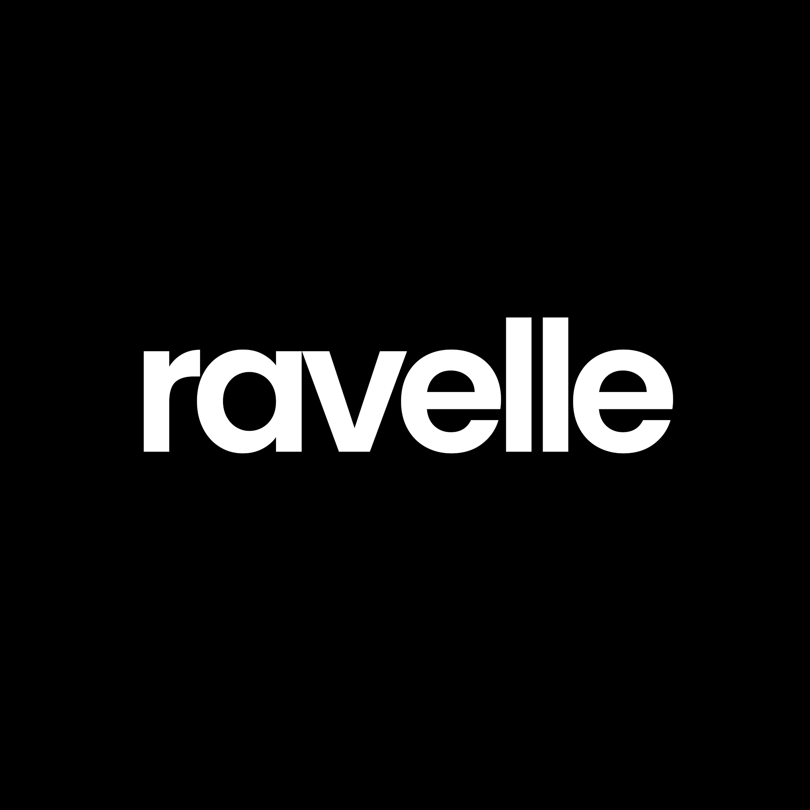

<p align="center">
  
</p>

<h1 align="center">Ravelle</h1>

<p align="center">
  A lightweight self-hosted video streaming web app with a clean dark interface, responsive layout, upload support, and playback for MP4, MKV, WEBM, TS, and HLS streams.
</p>

<p align="center">
  
  
  
  
</p>

## Preview

### Home Page


### Player Page


## Features

### Core Features
- Clean dark UI
- Responsive layout for desktop and mobile
- Separate home, search, and player pages
- Built-in video upload from the web interface
- Thumbnail generation for supported videos
- Simple self-hosted setup using Node.js and Express

### Supported Formats
- MP4
- MKV
- WEBM
- TS
- M3U8 / HLS

### Web Features
- Home page with video grid
- Search page with separate route
- Player page with related videos
- Upload button in the top bar
- Mobile-friendly layout
- Local view counter display
- Custom favicon and page title support

## Tech Stack

- Node.js
- npm
- Express
- Multer
- fluent-ffmpeg
- hls.js
- mpegts.js
- HTML, CSS, and JavaScript

## Installation

Make sure the following are installed on your system:

- Node.js
- npm
- FFmpeg

Clone the repository:

```bash
git clone https://github.com/your-username/ravelle.git
cd ravelle
